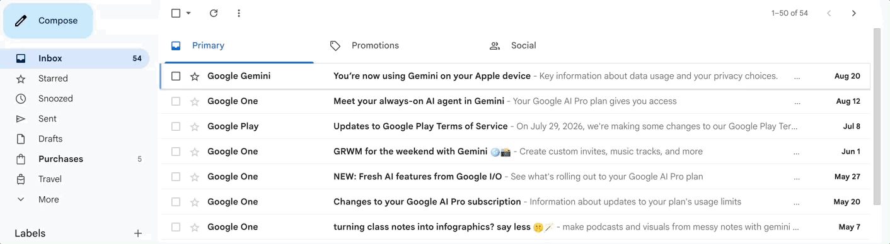

# Gmail Superhuman Keys

Superhuman's keyboard shortcuts, added to Gmail.



No OAuth, no Gmail API, no network calls. Every shortcut changes the URL, fires
one of Gmail's own keystrokes, or clicks a control Gmail already renders; `Ctrl+/`
copies the address you are already on. Nothing touches your mail that Gmail could
not already do.

## Shortcuts

On by default:

| Key | Does | id |
|---|---|---|
| `Ctrl+1` … `Ctrl+9` | Switch Google account | `account1`…`account9` |
| `Tab` / `Shift+Tab` | Next / previous inbox tab | `tabNext`, `tabPrev` |
| `g` `e` | Go to Done (archived mail) | `goDone` |
| `g` `m` | Go to Muted | `goMuted` |
| `g` `h` | Go to Reminders (snoozed) | `goReminders` |
| `g` `!` | Go to Spam | `goSpam` |
| `g` `#` | Go to Trash | `goTrash` |
| `h` | Snooze | `snooze` |
| `Shift+M` | Mute | `mute` |
| `Shift+E` | Mark not done (back to inbox) | `markNotDone` |
| `e` | Mark done (archive) | `archive` |
| `#` | Trash | `trash` |
| `!` | Spam | `spam` |
| `s` | Star | `star` |
| `l` | Label | `label` |
| `v` | Move to | `moveTo` |
| `Enter` | Reply all (inside a conversation) | `replyAll` |
| `Shift+Enter` | Pop out reply all | `popReplyAll` |
| `Shift+C` | Pop out compose | `popCompose` |
| `Shift+O` | Expand / collapse conversation | `expandAll` |
| `Ctrl+/` | Copy link to conversation | `copyLink` |

Off until you ask for them, because each takes a Gmail shortcut away:

| Key | Does | Costs | id |
|---|---|---|---|
| `Shift+U` | Filter to unread | Gmail's mark-as-unread | `filterUnread` |
| `Shift+S` | Filter to starred | nothing | `filterStarred` |
| `Shift+I` | Filter to important | Gmail's mark-as-read | `filterImportant` |
| `u` | Toggle read / unread | Gmail's back-to-list | `readToggle` |
| `Escape` | Back to the list | nothing | `backToList` |

Turn them on by id in `config.js`:

```js
enabled: ['filterStarred', 'readToggle', 'backToList'],
```

`readToggle` and `backToList` are a pair — the first takes `u`, the second gives
its old job to `Escape`, which costs nothing: Gmail's only `Escape` leaves a text
field, and `shouldIgnore` hands the key back in every field and dialog anyway.
Enable `filterUnread` and `filterImportant` together and both of Gmail's
read-state keys are gone; `readToggle` puts both directions back on one key.

### Already the same

These need no binding: Superhuman and Gmail agree, and Gmail's own shortcut is
left alone. `r` reply, `f` forward, `Shift+R` / `Shift+F` pop-out reply and
forward, `c` compose, `/` search, `?` shortcuts, `z` undo, `x` select, `j` / `k`
next and previous conversation, `n` / `p` next and previous message, `o` expand
the focused message, `y` remove label, `[` / `]` archive and move on,
`g` `i` / `s` / `t` / `d` / `a` / `l` for Inbox, Starred, Sent, Drafts, All mail
and Label.

### Not here

`Cmd+K` needs a command palette, and this extension deliberately draws no UI of
its own. The calendar keys (`0`, `-`, `=`) and snippets (`Cmd+;`) would need the
same. Superhuman's `Shift+R` no-reply filter is computed server-side and no Gmail
search operator expresses it. The compose-window shortcuts
(`Cmd+Shift+O/S/M/A/,/I/H/L`, `Cmd+U` unsubscribe, `Cmd+Shift+Enter` send and
done) are not here yet: `shouldIgnore` exempts compose entirely, and inverting
that guard is its own piece of work.

## Install

1. `cp config.example.js config.js` and put your own email addresses in it.
   This step is required — `config.js` is gitignored, and the extension will
   not load without it.
2. Open `chrome://extensions`
3. Turn on **Developer mode** (top right)
4. **Load unpacked** → select this folder

After editing any file, hit reload on the extension card **and then reload
Gmail**. Reloading the extension alone is not enough: content scripts are
injected at page load, so an already-open Gmail tab keeps running the old code.

Requires Gmail's inbox type to be **Default** (the one with tabs) for `Tab` to
have anything to cycle, and Gmail's keyboard shortcuts turned on
(Settings → General → Keyboard shortcuts) for everything that fires one.

## Configure

Everything lives in `config.js`:

- **`accounts`** — the addresses you are signed into in this Chrome profile, in
  the order you want them on `Ctrl+1..9`. List three and only `Ctrl+1..3` bind;
  the rest keep whatever Chrome does with them.
  These are resolved with Gmail's `?authuser=` parameter rather than the
  `/u/0/`, `/u/1/` indices, because those indices are assigned in sign-in order
  and renumber if you sign out — which would quietly point `Ctrl+2` at the
  wrong mailbox.
- **`tabs`** — leave `null` to read Gmail's own tab bar, so enabling or
  disabling a category in Gmail settings just works. Set a list like
  `['Primary', 'Promotions']` to cycle a subset.
- **`enabled`** — ids from the opt-in table above.
- **`disabled`** — ids to switch off, for anything on by default.
- **`debug`** — `true` logs every decision to the console. A working install
  prints `[gsk] ready, N bindings, M accounts` on load, which is the quickest
  way to tell whether a reload actually took.

## Worth knowing

- **Done is Gmail's archive.** Superhuman's Mark Done and Gmail's archive are
  the same operation — both drop the `INBOX` label, nothing moves. There is no
  separate Done folder, so `g` `e` is a saved search (`in:archive`) rather than
  a route, and Mark Not Done re-adds the label through Gmail's Move to Inbox
  control.

- **Actions follow your mouse, not a checkbox.** Gmail acts on *checked*
  conversations and ignores both the mouse and the keyboard cursor, which is why
  its shortcuts feel dead next to Superhuman's. The bindings that act on a
  conversation tick a box first: an existing selection is left alone, otherwise
  the row under the mouse, otherwise the row under the cursor, otherwise nothing
  happens. A deliberate multi-select is never redirected at whatever the mouse
  happens to be over.

- **Gmail already has inbox tabs on a key.** `` ` `` and `~` cycle them
  natively. This extension exists to put the action on `Tab`, matching
  Superhuman's muscle memory.

- **`Tab` no longer moves focus** in the main Gmail view. It still does inside
  compose, search, dialogs, and any text field — that is what `shouldIgnore`
  in `core.js` protects.

- **Both chord machines run at once.** Pressing `g` is never swallowed, so
  Gmail arms its own chord alongside ours. That only works because every leaf
  claimed here (`e`, `m`, `h`, `!`, `#`) is one Gmail leaves free. Check that
  before adding another.

- **A `g` stays armed for 1.5 seconds.** Long enough to type the chord
  deliberately, short enough that a stray `g` does not swallow the next
  keystroke. Any second key the table does not claim ends the chord and falls
  through, which is how Gmail's own `g` `i` and friends still land.

- **Modifiers arrive as their own keydown.** Typing `!` is a `Shift` keydown
  then a `!` keydown, so the chord machine has to sit still for modifiers or
  every chord ending in shifted punctuation dies before its leaf arrives.

- **Synthesized keystrokes carry the shifted character.** A real keyboard
  reports Shift+A as `A`, and Gmail reads `e.key`, so sending `a` with
  `shiftKey` set is a keystroke Gmail ignores. Letters are uppercased under
  shift; punctuation like `:` already encodes it.

- **Tab switching activates Gmail's real tab**, rather than routing to a
  `#category/...` URL. The tabs are Closure controls (`DIV[role=tab]` with
  `J-KU-*` state classes, no `jsaction`, no anchor) and Closure activates on
  mousedown, so a bare `el.click()` does nothing at all. `core.activate`
  therefore dispatches `mousedown` → `mouseup` → `click`. Gmail switches in
  place, so the view stays mounted and the query is not re-run. Routing is kept
  only as a fallback for views where the tab bar is not on screen.

- **Account switching is a full page load**, so expect a beat while Gmail
  reloads. Superhuman's native app keeps accounts warm in memory; a Gmail
  extension structurally cannot.

- **`Shift+Enter` does nothing from the list.** Gmail's `Shift+a` needs an open
  conversation, and making it work from the list would mean opening a
  conversation in order to reply to it.

## Adding a shortcut

Add a row to `bindings.js`. It is the whole extension point: the table is data,
and the four files load in the order `manifest.json` names them.

```js
{ id: 'goDone', key: 'e', chord: 'g', action: 'nav', arg: '#search/in%3Aarchive' },
```

A row carries the key and the modifiers it demands (`shift`, `ctrl`, `meta`,
`alt`, each defaulting to "must be absent", or `'any'` for shifted punctuation
that already encodes itself), an optional `chord` prefix, and an action name.
The actions are `account`, `cycleTab`, `nav`, `key`, `click`, `copyLink`,
`readToggle` and `expandToggle`, and they live in `content.js`. Three flags do
the rest of the work:

- **`optIn`** — the row costs a Gmail native, so it stays off until `config.enabled`
  names its id. Say what it costs in the comment above it.
- **`needsTarget`** — the row acts on a conversation, so `content.js` ticks a box
  first. Without it the key quietly does nothing.
- **`requiresThread`** — the row only means something inside an open conversation,
  so in the list the key goes back to Gmail. That is how `Enter` and `Shift+O`
  keep Gmail's meaning where Superhuman's would be wrong.

`core.js` decides which binding a keypress matches and stays pure: no DOM, no
navigation, no globals. `content.js` is the wiring that touches the page.

## Tests

Not needed to install: Chrome loads only the four files `manifest.json` names,
so `test/`, `diag/` and `docs/` never reach the browser.

```sh
node --test test/core.test.js
```

80 cases cover `core.js` — which binding a keypress matches, how the chord
machine steps, what to synthesize, what an action should act on — hitting every
exported function and all but one line. `content.js` is wiring over it and is
verified by hand in Gmail.

`diag/` holds the scripts that established how Gmail behaves, each carrying its
measured result in a header comment. `inspect-tabs.js` worked out how the inbox
tabs activate; `inspect-keys.js` worked out that Gmail acts on synthetic
keystrokes, reads `e.key`, and does not check `isTrusted`. Re-run them if Gmail
ever changes underneath this.

`docs/superpowers/plans/` holds the parity plan the current shortcut set was
built from, with the measured Gmail behaviour behind each binding.

## Not affiliated

Superhuman Labs and Google neither endorse nor sponsor this extension, and
neither has any connection to it. Superhuman and Gmail are their respective
trademarks, used here only to say what this works with. Every shortcut maps onto
a command Gmail already ships; none of Superhuman's code appears anywhere in it.

## License

MIT — see [LICENSE](LICENSE).
